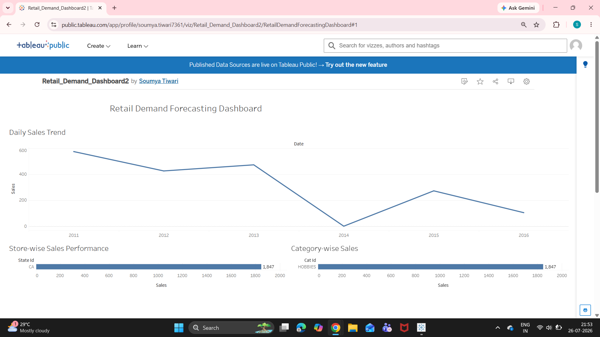
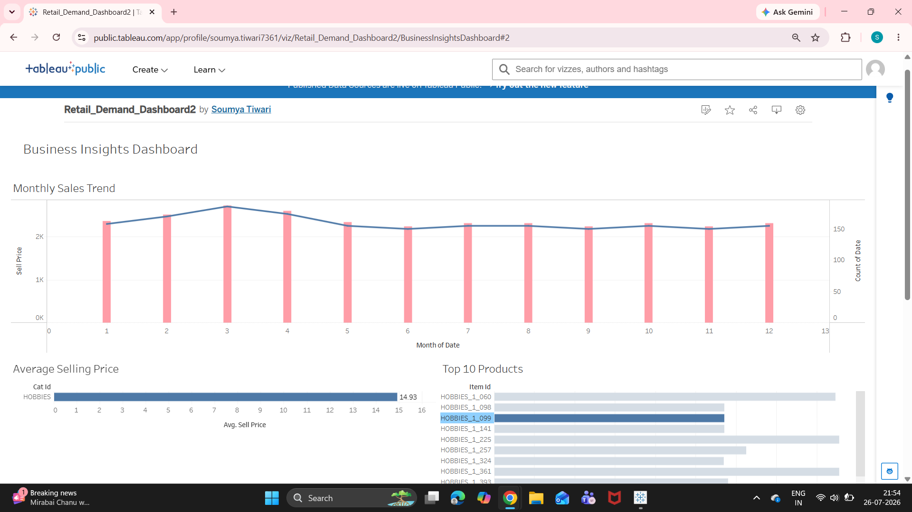

# 🛒 Retail Demand Forecasting & Inventory Optimization

An end-to-end Data Analytics and Machine Learning project using the Walmart M5 Forecasting dataset. This project predicts future retail demand, evaluates forecasting models, and presents business insights through interactive Tableau dashboards.
# 🛒 Retail Demand Forecasting & Inventory Optimization

## 📌 Project Overview

This project focuses on forecasting retail product demand using the Walmart M5 Forecasting dataset. It combines time-series forecasting and machine learning techniques to predict future sales and help optimize inventory management.

The project follows a complete data analytics workflow, including data preprocessing, exploratory data analysis (EDA), feature engineering, forecasting, model evaluation, and dashboard development.

---

## 🎯 Project Objectives

- Analyze historical retail sales data.
- Clean and preprocess large datasets.
- Perform exploratory data analysis (EDA).
- Engineer meaningful features for forecasting.
- Build forecasting models using Prophet and LightGBM.
- Compare model performance.
- Create interactive Tableau dashboards.
- Generate business insights for inventory optimization.

---

## 🛠️ Tech Stack

- Python
- Pandas
- NumPy
- Matplotlib
- Scikit-learn
- Prophet
- LightGBM
- Tableau Public
- Git & GitHub

---

## 📂 Project Structure

```
Retail-Demand-Forecasting-and-Inventory-Optimization/
│
├── data/
│   ├── raw/
│   └── processed/
│
├── notebooks/
│   ├── 01_data_loading.ipynb
│   ├── 02_data_cleaning.ipynb
│   ├── 03_data_merging.ipynb
│   ├── 04_eda_visualization.ipynb
│   ├── 05_feature_engineering.ipynb
│   ├── 06_data_preparation.ipynb
│   ├── 07_prophet_forecasting.ipynb
│   ├── 08_model_evaluation.ipynb
│   ├── 09_lightgbm_model.ipynb
│   └── 10_model_comparison.ipynb
│
├── reports/
│   ├── Week_1_Report.md
│   └── Week_2_Report.md
│
├── dashboards/
├── screenshots/
├── README.md
├── requirements.txt
└── .gitignore
```

---

# 📅 Weekly Progress

## ✅ Week 1 – Data Preparation

- Loaded Walmart M5 datasets
- Cleaned missing values
- Merged datasets
- Performed Exploratory Data Analysis (EDA)
- Created master dataset

### Notebooks

- 01_data_loading
- 02_data_cleaning
- 03_data_merging
- 04_eda_visualization

---

## ✅ Week 2 – Forecasting

- Feature Engineering
- Data Preparation
- Prophet Forecasting
- Model Evaluation
- LightGBM Model
- Model Comparison

### Notebooks

- 05_feature_engineering
- 06_data_preparation
- 07_prophet_forecasting
- 08_model_evaluation
- 09_lightgbm_model
- 10_model_comparison

---

# 📊 Key Results

- Successfully forecasted future retail sales.
- Compared Prophet and LightGBM forecasting models.
- Evaluated models using MAE, RMSE, and MAPE.
- Identified important features influencing demand prediction.

---

# 📸 Project Screenshots

## Prophet Forecast


---

## Prophet Components


---

## Actual vs Predicted Sales


---

## LightGBM Feature Importance


---

# 📈 Business Insights

- Historical sales trends improve forecasting accuracy.
- Feature engineering significantly enhances machine learning performance.
- LightGBM identifies the most influential demand-driving factors.
- Demand forecasting supports better inventory planning and reduces stock shortages.

---

# 🚀 Future Enhancements

- Build an interactive Tableau dashboard.
- Deploy the forecasting model using Streamlit.
- Add real-time demand prediction.
- Integrate inventory optimization recommendations.

---

# 📚 Learning Outcomes

Through this project, I gained practical experience in:

- Data Cleaning
- Data Preprocessing
- Exploratory Data Analysis
- Feature Engineering
- Time-Series Forecasting
- Machine Learning
- Model Evaluation
- Data Visualization
- Version Control using Git & GitHub

## 📊 Interactive Tableau Dashboard

This project includes two Tableau dashboards:

### Dashboard 1 – Retail Demand Forecasting
- Daily Sales Trend
- Store-wise Sales
- Category-wise Sales

### Dashboard 2 – Business Insights
- Monthly Sales Trend
- Average Selling Price
- Top 10 Products

### Dashboard Preview





### Tableau Public

🔗 [View Interactive Dashboard](https://public.tableau.com/app/profile/soumya.tiwari7361/viz/Retail_Demand_Dashboard2/BusinessInsightsDashboard#2)

📈 Key Business Insights
Sales fluctuate over time, highlighting seasonal demand patterns.
Certain products consistently contribute the highest sales volumes.
Average selling prices vary across product categories.
Monthly sales trends can help businesses forecast demand and plan inventory more effectively.
## 🚀 Project Highlights

- Data Cleaning & Preprocessing
- Exploratory Data Analysis (EDA)
- Feature Engineering
- Time Series Forecasting using Prophet
- LightGBM Model
- Model Evaluation (MAE, RMSE, MAPE)
- Interactive Tableau Dashboards
- Business Insights
## 📊 Dashboard Preview

### Retail Demand Forecasting Dashboard

![Dashboard 1]


### Business Insights Dashboard

![Dashboard 2]


## 🛠️ Technologies Used

- Python
- Pandas
- NumPy
- Matplotlib
- Prophet
- LightGBM
- Scikit-learn
- Tableau
- Git & GitHub
## 🔮 Future Enhancements

- Deploy the forecasting model as a web application.
- Integrate real-time sales data.
- Add automated inventory recommendations.
- Explore deep learning models such as LSTM for forecasting.
## Results

- Successfully forecasted retail demand.
- Compared Prophet and LightGBM models.
- Built two Tableau dashboards.
- Generated business insights for inventory planning.